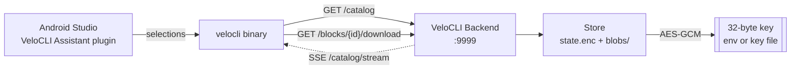

# VeloCLI Backend

[](https://go.dev)
[](https://github.com/GoogleContainerTools/distroless)
[](go.mod)

The catalog and block-distribution service behind [VeloCLI](https://plugins.jetbrains.com/plugin/30239),
the Flutter project scaffolding suite. It stores the catalog of code blocks a generated
project can be assembled from, serves them to the CLI, and encrypts every block at rest.

Written in Go with **one direct dependency** (`golang.org/x/crypto`). The HTTP layer,
routing, JSON, and server are all standard library.

---

## How it fits together



The store keeps an encrypted state file plus one encrypted blob per block. Writes are
atomic (`writeFileAtomic`), and catalog changes fan out to subscribers over Server-Sent
Events so a connected CLI sees a new catalog without polling.

---

## API

Public routes:

| Method | Path | Purpose |
|---|---|---|
| `GET` | `/healthz` | Liveness probe. Returns `OK`. |
| `GET` | `/api/v1/version` | Latest and minimum supported client version. |
| `GET` | `/api/v1/catalog` | The current block catalog. |
| `GET` | `/api/v1/catalog/stream` | SSE stream, pushes on every catalog change. |
| `GET` | `/api/v1/blocks/{id}/download` | Download one encrypted block blob. |

Admin routes:

| Method | Path | Purpose |
|---|---|---|
| `PUT` | `/api/v1/admin/catalog` | Replace the whole catalog. |
| `POST` | `/api/v1/admin/blocks` | Upload a new block and its blob. |
| `PUT` | `/api/v1/admin/blocks/{id}` | Update a block's metadata. |
| `DELETE` | `/api/v1/admin/blocks/{id}` | Delete a block. |
| `GET` | `/admin` | Admin page for block management. |

### Client version gating

`versionMiddleware` reads the `X-VeloCLI-Version` header. A client older than
`serverMinSupportedVersion` gets **`426 Upgrade Required`** with the minimum and latest
versions in the body, so an outdated CLI fails with a clear instruction rather than a
confusing parse error. `/healthz`, `/admin`, `/` and `/api/v1/version` are exempt, so
version discovery and health checks always work.

---

## Encryption

Blocks and catalog state are encrypted at rest with **AES-GCM** via a 32-byte key.
`cryptox.LoadKeyFromEnvOrFile` resolves the key in this order:

1. the `VELOCLI_DATA_KEY` environment variable
2. the file at `VELOCLI_DATA_KEY_FILE`

Key length is validated on both paths — a key that is not exactly 32 bytes is rejected at
startup rather than failing later during a decrypt.

---

## Before deploying

This service is not currently deployed. Two things to settle before it is:

**1. The admin endpoints have no authentication.** `routes()` wraps the mux in
`logMiddleware` and `versionMiddleware` only. Neither performs authentication, and there
is no `Authorization` handling anywhere in the module. As written, anyone who can reach
the port can replace the catalog, upload blocks, and delete blocks. Put the `/api/v1/admin/*`
routes and `/admin` behind an auth middleware, or bind the service to loopback and reach
it through an authenticating reverse proxy.

**2. The key must not live in the image or the repository.** The Dockerfile currently does
`COPY data /srv/data`, which bakes whatever is in `data/` — including `data/.key` — into
every built image. Mount the key at runtime or inject `VELOCLI_DATA_KEY` as a secret. A
`.gitignore` now excludes `data/` and `*.key`; the key already in history should be rotated
before the service handles anything real.

---

## Running

```bash
# from source
go build -o veloback ./cmd/api
VELOCLI_DATA_KEY_FILE=/path/to/key VELOCLI_BACKEND_ADDR=127.0.0.1:9999 ./veloback
```

```bash
# container — key mounted at runtime, not baked in
docker build -t velocli-backend .
docker run --rm -p 9999:9999 \
  -e VELOCLI_DATA_KEY="$(cat /path/to/key)" \
  velocli-backend
```

| Variable | Default | Purpose |
|---|---|---|
| `VELOCLI_BACKEND_ADDR` | `0.0.0.0:9999` | Listen address. |
| `VELOCLI_DATA_KEY` | — | 32-byte key, takes precedence. |
| `VELOCLI_DATA_KEY_FILE` | `/srv/data/.key` | Key file, used when the variable is unset. |

---

## Layout

```
cmd/api/main.go        routing, handlers, middleware, server wiring
internal/store/        catalog + block persistence, SSE subscribers, atomic writes
internal/cryptox/      AES-GCM encrypt/decrypt, key loading and validation
Dockerfile             multi-stage build onto gcr.io/distroless/base-debian12
```

## Related

- [VeloCLI Assistant](https://plugins.jetbrains.com/plugin/30239) — the Android Studio plugin
- [VS Code extension](https://marketplace.visualstudio.com/items?itemName=VeloLabs.velovsplugin)
